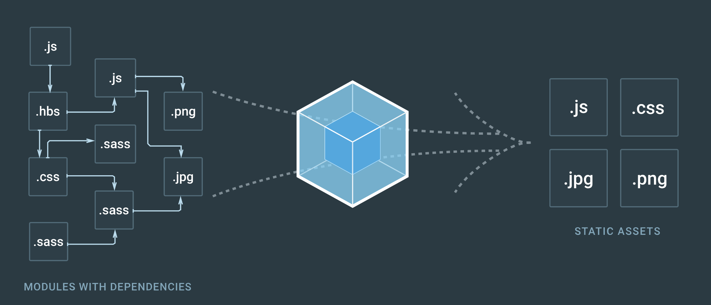

# Tutorial: Frontend Development

|||
|:--|:--|
||Have you ever wanted to start building frontend web applications, but always hit a road block at one point or another? Have you experienced the pain of constantly reloading an `index.html` page to see your changes? Is it possible that you don't even know how to get started? Perhaps you already have a basic project, but you don't know how to bundle it for production?|

If you have experienced any of the pain points above, then keep reading. This article is a guide to conquering all the caveats mentioned above. I will begin with a basic project structure, using NodeJS and Webpack.

# Quickstart

If you want the source code, find it on [`https://github.com/bilo-io/tut-fed`](https://github.com/bilo-io/tut-fed). You can clone, setup and run it with the following console commands:

- `git clone https://github.com/bilo-io/tut-fed.git`
- `cd ./tut-fed`
- `npm install`
- `npm start`
- [http://localhost:6565](http://localhost:6565)

> **NOTE**: 
> - While `npm start` uses the Webpack DevServer, using the `src` folder ... use this while developing.
> - The express server can be used with `node server.js` which serves the `dist` (distribution/production folder).
> - The `dist` folder is generated with the  `npm run build` command.

# Overview

There are certain goals set out, which will be accomplished by the end of this article. The purpose of this article is for a frontend developer:

## Goals
- to have a webapp that dynamically reloads while changes happen in files during development
- to easily accomplish tasks with command line scripts (e.g. install dependencies, start app, create prod build, etc.)
- to use a package manager for 3rd party libraries
- to use a module and application bundler

## Structure

As such this tutorial is structured in the following logical flow:

1. **Project Structure** - The a basic, manageable folder structure we will create throughout the tutorial.
2. **Example WebApp** - A basic web application consisting of the minimal amount of files.
3. **Node**- Adding a package manager, dependencies, and a server to serve up the webapp.
4. **Webpack** - Adding a webapp bundler, allowing for development mode and production packaging.


# 1. Project Structure

We will have a very simple, yet manageable project structure. If you are following along with the tutorial, create your root project folder (e.g. `tut-fed`, from here on referred to as `root`) as follows:
```sh
tut-fed/                    # project root
├───dist/                   # prod app bundle
├───node_modules/           # node dependencies
├───src/                    # webapp source code
│   │
│   ├───app.js              # application logic
│   ├───index.html          # entry point to app
│   └───style.css           # styles for app appearance
│
├───package.json            # node package file
├───server.js               # serves webapp in prod
└───webpack.config.js       # webpack config for bundling
```
 The table below explains each of these files, and in the rest of the article we construct this structure in a comprehensive set of steps.

|File | Purpose |
|:-----|:--------|
| `package.json`| a Node package file, listing the webapp's dependencies, command line scripts, etc.|
|`server.js`| serves the webapplication in the `dist` folder|
|`webpack.config.js`| Webpack configuration file for bundling the application|
| `src/`      | source folder of the webapp, containing at the very least an `index.html` |
| `dist/`| (generated) distribution folder, which contains the production package |
|`artifact/`| (generated) application package with server, to test prod deployment locally|
|`node_modules/`| (generated) Node dependencies, 3rd party packages the webapp requires to function|

For now, let's focus on the contents of the `src` folder, where we create a basic web app with basic `index.html`, `style.css` and `app.js` files. 

# 2. Example WebApp

We will begin this tutorial with a simple `index.html` file as the entry point of the application. Create this in the `src` folder of your project root. NOTE: you can easily convert images to `.ico` for the tab icon in your browser, using [icoconvert.com](http://icoconvert.com/).

`root/src/index.html`:
```html
<!DOCTYPE html>
<html>

    <head>
        <title>Frontend Dev</title>
        <!--Icon-->
        <link rel="shortcut icon" type="image/x-icon" href="./favicon.ico" />
        <!--Font-->
        <link rel="stylesheet" type="text/css" href="//fonts.googleapis.com/css?family=Quicksand" />
        <!--Styles-->
        <link rel="stylesheet" href="./style.css" />
        <!--Javascript-->
        <script src="./app.js"></script>
    </head>

    <body>
        <div id="app">
            <div class="app-titlebar">
                
                <label>FED Tutorial 101</label>
            </div>
            <div class="app-content">
                <p><b>Hello FEDs</b></p>
                <p>Now you know how to make a basic web site.</p>
            </div>
        </div>
    </body>

</html>
```

Open the `index.html` file in a browser and you should see the message **"Hello FEDs"** displayed in the window. To customize the appearance, add style file to accompany the styles the header `h1`. You can also apply many other style updates with CSS, for example box-shadow, for which I use this [Box Shadow Generator]](http://www.cssmatic.com/box-shadow).

`src/style.css`:
```css
body {
    color: #00adee;
    background: #1e1e1e;
    padding: 1em;
}

img {
    width: 2rem;
    height: 2rem;
    margin-left: 2rem;
    margin-right: 2rem;
    margin-top: 1rem;
}

label {
    font-size: 1.5rem;
    line-height: 4rem;
}

#app {
    font-family: Quicksand, sans-serif;
}

.app-titlebar {
    position: fixed;
    display: flex;
    top: 0;
    left: 0;
    height: 4rem;
    width: 100vw;
    -webkit-box-shadow: 0px 6px 20px -5px rgba(0,0,0,0.75);
    -moz-box-shadow: 0px 6px 20px -5px rgba(0,0,0,0.75);
    box-shadow: 0px 6px 20px -5px rgba(0,0,0,0.75);
    z-index: 1;
}
.app-titlebar:hover {
    color: white;
    cursor: pointer;
}

.app-content {
    position: fixed;
    top: 4rem;
    left: 0;
    height: calc(100vh - 4rem);
    width: 100vw;
    background: #eee;
    color: #333;
    padding: 1rem;
}
```

Refresh the page, and you should see the header style has changed. This is a minimal example of a webapp, which will be used and edited throughout the rest of the article.


# 3. Node

Here we will turn the webapp into a Node package. This will be useful with installing dependencies using the [Node Package Manager](), as well as running scripts to perform certain tasks with the webapp.

> **NOTE:**
> - conventionally, you would have to search the web for the `.js` or `.min.js` files, and put them into your `lib` folder or something like that.
> - `npm` (Node Package Manager) handles all this laborious task for you.

## Creating a Node Package

In the root of your application run the following command, and enter the desired prompts (author name, etc.):

- `npm init`

> **NOTE** you can skip all the prompts by repeatedly pressing `Enter` (return key).

## Express Server

Next, we will add [Express]() to serve the webapp locally on a port. Basically, all that happens here is that express will serve a folder containing an index.html file. This server will be serving up the webapp in the production environment. To install Express, run:

- `npm install express --save`

> **NOTE:** 
>   - `npm install` adds the specified libraries to the `node_modules` directory. 
> - the `--save` flag saves the dependency in the `dependencies` node in `packages.json`.
> - the `--save-dev` flag saves the dependency in the `devDependencies` node in `package.json`

Now we need to serve up the folder containing the webapp, for which we need to a `server.js` file.

`root/server.js`:
```javascript
var express = require('express');
var server = express();

let port = process.env.port || 6565;
server.use(express.static(__dirname + '/src/'));
server.listen(port, '0.0.0.0');
console.log('...listening on port: ' + port);
```

You can test this file by running the following command in your terminal:
- `node server.js`
The terminal should say `... listening on port 6565`, so try opening [http://localhost:6565](http://localhost:6565) in your browser, and you should see the webapp.

Lastly, let's make use of the npm scripts. Make the following update to

`package.json`:
```javascript
{
    // ...
    "scripts": {
        "serve": "node server.js"
    },
    // ...
    "dependencies" : {
        // libraries used for the prod version ... need to be installed in prod
    },
    // ...
    "devDependencies" : {
        // libraries required by the app ... added to production bundle/package
    }
}
```

Now you should accomplish the same effect by using the following terminal command:

- `npm run serve`


Furthermore, in the `package.json` you can add additional, **named** scripts, that automate arbitrary tasks. We will get to this after **Webpack** has been fully integrated, and providing us with the ability to easily create an application bundle.

# 4. Webpack

Webpack is useful for bundling your application for production. You can include a variety of file extensions in your app, and these can be loaded with `loader` plugins for Webpack. Furthermore, you can run your app in continuous development mode, such that the app is recompiled when edits take place. Let's get started!

## Overview of webpack



## Setup Webpack

Make sure to have Webpack installed globally:

- `npm install -g webpack`

Now you need to add webpack to your actual webapp. 
It is recommended to install the [`webpack-dev-server`](https://www.npmjs.com/package/webpack-dev-server) for continous development (refresh on save).
Another useful tool is the [`webpack-bundle-analyzer`](https://www.npmjs.com/package/webpack-bundle-analyzer) to inspect what is in the bundle.

- `npm install webpack --save-dev`
- `npm install webpack-dev-server --save-dev`
- `npm install webpack-bundle-analyzer --save-dev`

And that's it... now you're good to go.

>**NOTE**: we installed all of the above to the `devDependencies`, because they are only used for development and to bundle the application. The production bundle does not need any of these dependencies, as it only needs to serve up the application code, and all `required` libraries (imported in the `src` folder).


## Configure your Webapp for Webpack

Now you need to configure Webpack, in order to tell it which files to bundle. Every Webpack configuration requires at the very least an `entry` and `output` node. 

> - `entry` specifies the entry point (`.js`) from which Webpack bundles everything that is imported, including images, libraries, etc. 
> - `output` is the directory where you want to put the bundle generated by Webpack (`dist/`). 

Create the following Webpack configuration file on the root:

`webpack.config.js`:
```javascript
var webpack = require('webpack');
var path = require('path');
const HtmlWebpackPlugin = require('html-webpack-plugin');

var DIST = path.resolve(__dirname, 'dist/');
var SRC = path.resolve(__dirname, 'src/');

var config = {
    entry: {
        path: SRC + '/app.js'
    },
    output: {
        path: DIST,
        publicPath: 'http://localhost:6565/',
        filename: 'app.js'
    },
    module: {
        rules: [{   
                // used to load CSS
                test: /\.css$/,
                loaders: ['style-loader', 'css-loader'],
                exclude: /node_modules/
            }, {
                // used to load image files
                test: /\.(png|jpe?g|gif|svg|woff|woff2|ttf|eot|ico)$/,
                loader: 'file-loader?name=assets/[name].[ext]'
            }
        ]
    },
    plugins: [
        new HtmlWebpackPlugin({
            template: './src/index.html',
            filename: 'index.html',
            inject: 'body'
        })
    ],
    devServer: {
        historyApiFallback: true,
        stats: 'minimal'
    }
};

module.exports = config;
```

In this file we tell webpack to use the source folder `src/` and bundle it into `dist/`. Furthermore, we add **HtmlWebpackPlugin** so we can add the `index.html` to the bundle. To install this plugin use the following command:

- `npm install html-webpack-plugin --save-dev`


We need to specify to Webpack how to load `.css`, image files, etc., which is done with the some plugins, that you need to install:

- `npm install style-loader`
- `npm install css-loader`
- `npm install file-loader --save-dev`

> **NOTE:** `file-loader` loads files into the `assets/` folder of the bundle. which means you need to reference 
them from there, in the source code (except when you `require` or `import` them)


## Creating the Production Build

Lastly, add some scripts to make our lives a little easier. We can add aliases for commands, which will reside in `package.json` under the `scripts` node. They need to be run with the command `npm run {Script Name}`

`package.json`:
```javascript
"scripts": {
    "start": "webpack-dev-server --inline --progress --port 6565",
    "build": "webpack -p",
    "serve": "node server.js",
    "clean": "rm -rf ./dist",
    "setup": "npm install && npm start"
  },
```

Now we can run the `webpack-dev-server` with the command `npm start`. In this dev mode, any edits that you make recompile the app and serve the updated without having to manully reload the webapp after every change.

Furthermore, we can create a production package with the `build` script, the server should point to that directory (`dist/`) instead.

`server.js`:
```javascript
// ...

server.use(express.static(__dirname + '/dist/'));

// ...
```

You can easily test this by running `node server.js` from your terminal.

> **NOTE:** you need to run `npm run build` first, to generate the `dist` folder.

# SASS

There are several CSS preprocessors, that make styling your website/webapp a bit easier, two of which are [Sass & LESS](https://css-tricks.com/sass-vs-less/). Here we will be focusing on [Sass](http://sass-lang.com/), which requires Ruby in order to be installed.

### Installing SASS
- [Install SASS] (http://sass-lang.com/install)

You can verify whether it has been installed by running the command `sass -v` in a terminal.

Once this works, sass has been setup on your machine and the next step is to integrate it in the webapp.

### Adding SASS to Webapp

Since Webpack bundles the application, and we use the Webpack Dev Server for development, we need to modify our `webpack.config.js` to understand SASS files. 

`webpack.config.js`:

```javascript
    // Modify the css module rule as it is below
    // ...
    rules: [
        {
            test: /\.(css|scss)$/,
            loaders: [
                'style-loader', 'css-loader', 'sass-loader'
            ],
            exclude: /node_modules/
        },
    // ...

```
>**NOTE:** Each time you modify the `webpack.config.js` you need to restart the webapp, in order to see the new configuration in effect.

Essentially, all we need to do is add a `sass-loader` plugin, as well as `node-sass`:

- `npm install sass-loader --save-dev`
- `npm install node-sass --save-dev`

>**NOTE:** When you switch between node versions, your `node-sass` typically has to be rebuilt. To do this, simply run `npm rebuild node-sass`.

Now the webapp should be all set up. In the next section, we modify the `css` to be `scss`.

### Turning CSS into SASS

Firstly, rename the file `style.css` (and all references to it) to `style.scss`. Now, it is important to note that SASS is a superset of CSS, meaning that all CSS is valid SASS. There are many things that can be done with SASS, such as nesting of classes, creating variables, creating functions (mixins), using class inheritance, and more.

See the official [guide to SASS](http://sass-lang.com/guide) with core features, and a lovely [Cheat Sheet](https://sass-cheatsheet.brunoscopelliti.com/) that quickly shows you the SASS equivalent of CSS snippets.

We are going to modify the contents of  our `style.scss` to use some SASS features. See the end result of the style file here, and below that an explanation of how the CSS can be transformed into SASS.


```scss
// SASS: Variables - Colors
$col-shadow: rgba(0,0,0,0.75);
$col-text: #333;
$col-background: #eee;
$col-active: #00adee;

// SASS: Variables - Dimensions
$dim-image: 2rem;
$dim-font: 1.5rem;
$dim-titlebar: 4rem;
$dim-padding: 1em;

// SASS: Mixins
@mixin drop-shadow($color) {
    -webkit-box-shadow: 0px 6px 20px -5px $color;
    -moz-box-shadow: 0px 6px 20px -5px $color;
    box-shadow: 0px 6px 20px -5px $color;
}

.black-on-white {
    color: $col-text;
    background: $col-background;
}

body {
    color: $col-active;
    background: $col-text;
    font-family: Quicksand, sans-serif;
    padding: $dim-padding;
}

.app-titlebar {
    // SASS: mixin usage
    @include drop-shadow($col-shadow);

    position: fixed;
    display: flex;
    height: $dim-titlebar;
    width: 100vw;
    top: 0;
    left: 0;
    z-index: 1;

    // SASS: nested classes (img & label)
    img {
        width: $dim-image;
        height: $dim-image;
        margin-left: $dim-image;
        margin-right: $dim-image;
        margin-top: $dim-padding;
    }
    label {
        font-size: $dim-font;
        line-height: $dim-titlebar;
    }

    //SASS: multiple states
    &:hover {
        color: white;
        cursor: pointer;
    }
}

.app-content {
    // SASS: inheritance
    @extend .black-on-white;

    position: fixed;
    padding: $dim-padding;
    height: calc(100vh - #{$dim-titlebar});
    width: 100vw;
    top: $dim-titlebar;
    left: 0;
}
```


First, we create variables for the colors & sizes (or dimensions). Sass variables are created with the notation `$var-name: value`. As such, these are our variables.

```scss
// SASS: Variables - Colors
$col-shadow: rgba(0,0,0,0.75);
$col-text: #333;
$col-background: #eee;
$col-active: #00adee;

// SASS: Variables - Dimensions
$dim-image: 2rem;
$dim-font: 1.5rem;
$dim-titlebar: 4rem;
$dim-padding: 1em;

// Example Usage:
.some-class {
    color: $col-text;
    background: $col-background;
    height: $dim-titlebar;
    padding: $dim-padding;
}

```

Now let's consider the `.app-content` class first, as there is less going on here.

1. We position the app-content to be right underneath the titlebar on the y-axis, and to fill out the rest of the browser window.

```scss
.app-content {
    // ...
    top: $dim-titlebar;
    height: calc(100vh - #{$dim-titlebar});
    // ...
}
```

>**NOTE:** when performing calculations, you need to extract the actual value of the variable, using `#{ $var }`.

2. Furthermore, the app uses black text on a white background, which could well be used on some other classes too. Therefore, we create a `black-on-white` class and extend our app-content using that new class.

```scss
.black-on-white {
    color: $col-text;
    background: $col-background;
}

// SASS: Inheritance
.app-content {
    // ...
    @extend .black-on-white;
    // ...
}
```
Now we can move on to the more complex titlebar. 

1. The first thing we could do is make the `` and `<label></label>` tags be specific to the title bar class. All you need to do is drag the styles of `img` & `label` into the scope of `.app-titlebar`:
```scss
.app-titlebar {
    // ...
    // SASS: nested classes (img & label)
    img {
        width: $dim-image;
        height: $dim-image;
        margin-left: $dim-image;
        margin-right: $dim-image;
        margin-top: $dim-padding;
    }
    label {
        font-size: $dim-font;
        line-height: $dim-titlebar;
    }
    // ...
}
```

2. Then we bring the `:hover` state of the `app-titlebar` into it's class scope as well, using the following notation:
.app-titlebar {
    // ...
    //SASS: multiple states
    &:hover {
        color: white;
        cursor: pointer;
    }
    
}

3. Lastly, we add a mixin for the `drop-shadow`, in case we might want to use it elsewhere, but with a different color:

```scss
// SASS: Mixin
@mixin drop-shadow($color) {
    -webkit-box-shadow: 0px 6px 20px -5px $color;
    -moz-box-shadow: 0px 6px 20px -5px $color;
    box-shadow: 0px 6px 20px -5px $color;
}
// Example Usage:
.some-class {
    @include drop-shadow(#00adee);
}
```

Try to change some of variables and see how this affects the application. This is only scratching the surface of SASS. Now the fundamentals of frontend web development have been covered. The next set of tutorials will be making use of frameworks and libraries such as Angular, React and Leaflet.

# References

- Node
    - [NodeJS](https://nodejs.org/en/)
    - [ExpressJS](https://expressjs.com/)
- Webpack
    - [Webpack](https://webpack.js.org/)
    - [Webpack Dev Server](https://www.npmjs.com/package/webpack-dev-server)
    - [Webpack Bundle Analyzer](https://www.npmjs.com/package/webpack-bundle-analyzer)
- SASS
    - [SASS Guide](http://sass-lang.com/guide)
    - [SASS vs LESS](https://css-tricks.com/sass-vs-less/)
    - [SASS Installation](http://sass-lang.com/install)
